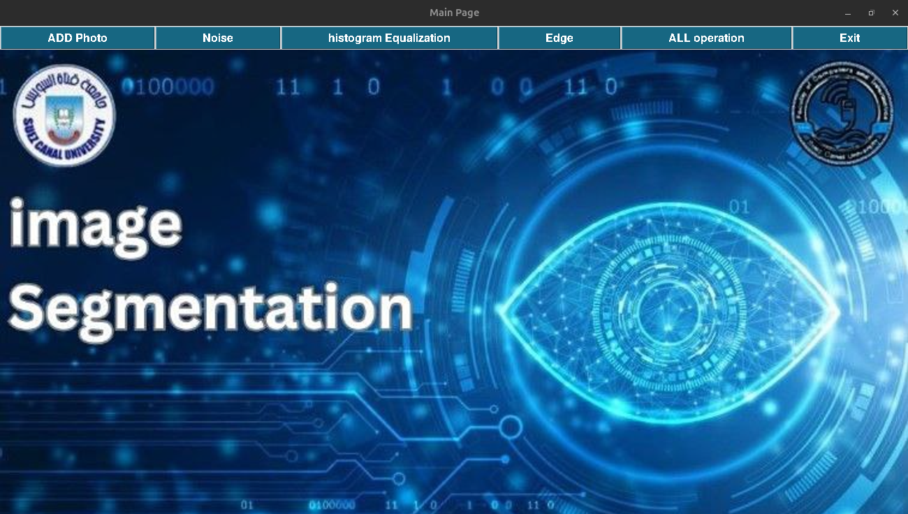
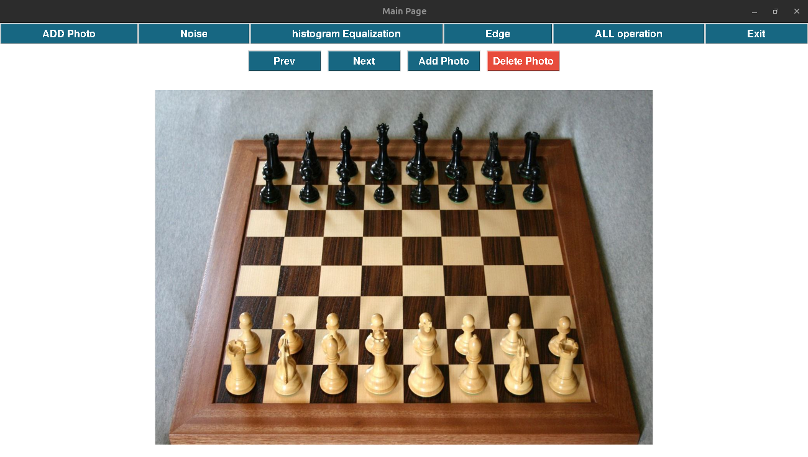
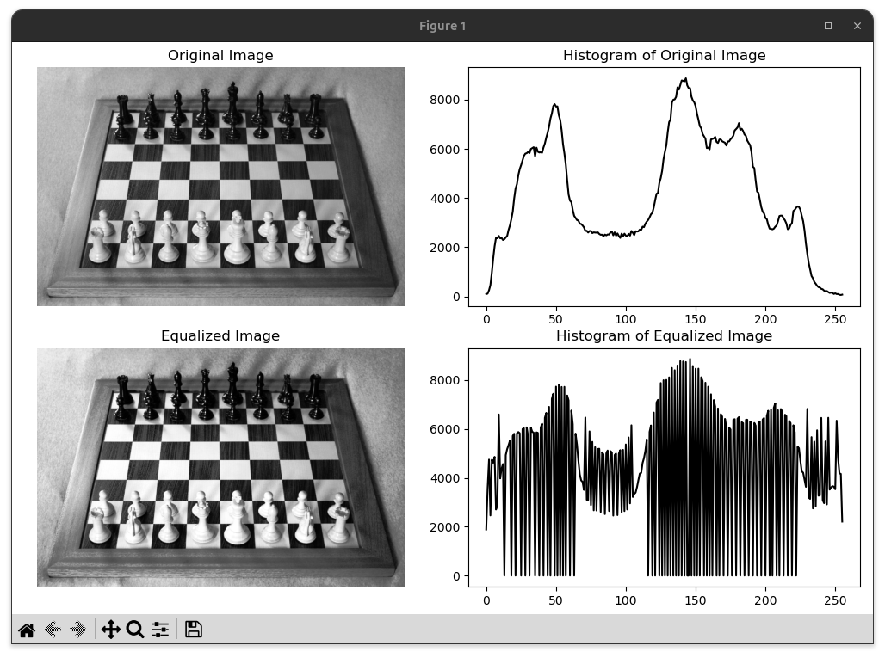
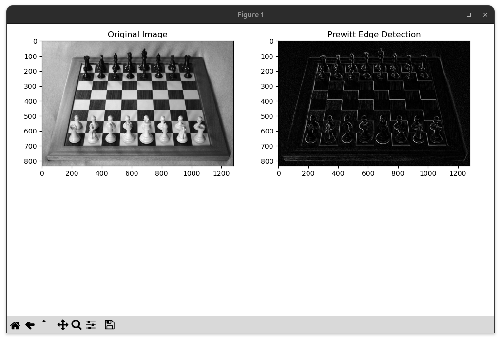

# Image-Segmentation
Image Segmentation using Edge Detection Techniques (Sobel, Prewitt) with Noise Addition, Noise Removal, Laplacian of Gaussian, and Histogram Equalization

## overview 
### main page 

### ADD & Remove Noise 

### Histogram Equalization

### Edge section (Sobel, Prewitt, LOG )

